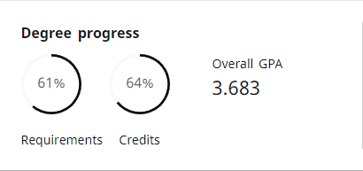

# 💫 About Me:
🦠GO CARDS! 🦠
📠I'm currently attending Lamar University (Junior)  
🌱 I’m currently learning front-end web development 
🔭 I’m currently working on mp4 ➡️ mp3 online convertor 
🤠I’m looking to collaborate on web projects 
🎮 I'm an avid gamer

# 💻 Tech Stack:
 
 

 
 
 

# 📊 GitHub Stats:
 
 

---

<!-- Proudly created with GPRM ( https://gprm.itsvg.in ) -->